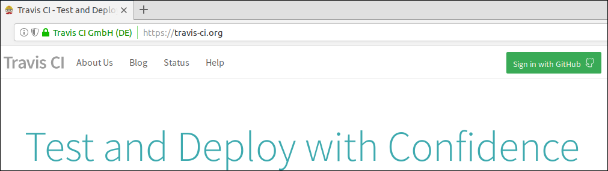
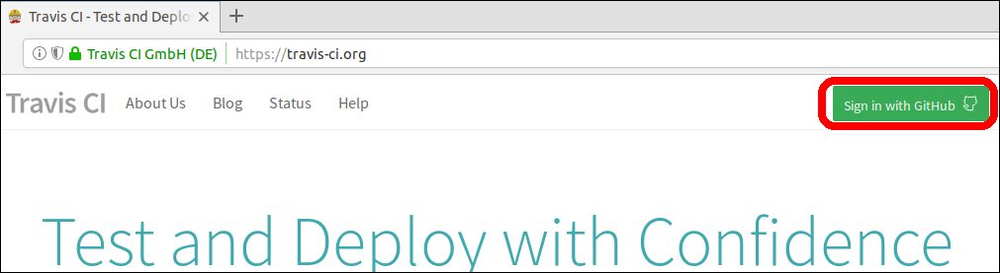
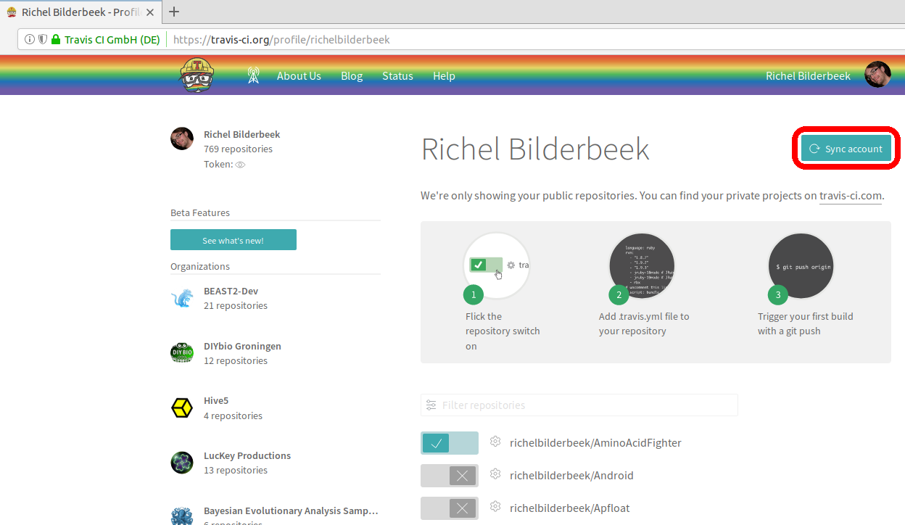

# Activate Travis CI on your GitHub

After [forking a chapter](fork_a_chapter.md), you must activate Travis CI to check your GitHub.

 * Go to [https://travis-ci.org/](https://travis-ci.org/)

 * Sign in with your GitHub

 * Go to your accounts

 * Click 'Sync accounts'

 * Activate your accounts by clicking the slider to the right. In the example above, 'AminoAcidFighter' is activated, where 'Android' is not
