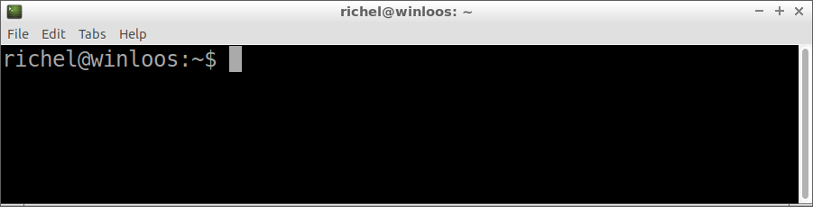
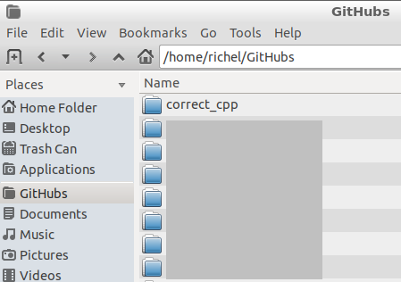

# Clone your fork

After [forking a chapter](fork_a_chapter.md), you must [clone your fork](clone_your_fork.md). This will download the GitHub repository to your local computer.

There are multiple ways to clone your fork:

 * From a terminal (GNU/Linux, Mac), or from Git Bash (Windows)
 * Using a `git` GUI

## Clone your fork from a terminal (GNU/Linux, Mac), or Git Bash (Windows)

 * Start your terminal or Git Bash



 * Use `git clone` from the command-line to download your fork. 
   For example, you can download the chapter [hello](https://github.com/richelbilderbeek/correct_cpp_hello) using the command below.
   Replace `yourname` by your GitHub username.

```
git clone https://github.com/yourname/correct_cpp_hello.git
```

 * The folder with the GitHub has been created.



Now it is time to [do the exercise](do_the_exercise.md).

## Clone your fork using a `git` GUI

There are many. And I do not use them. If you think this should be added, please add the text and pictures by a Pull Request.
