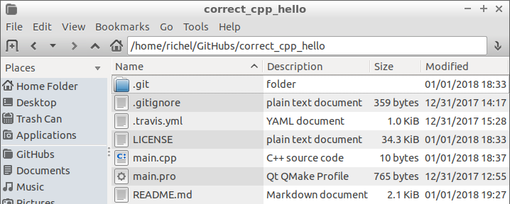
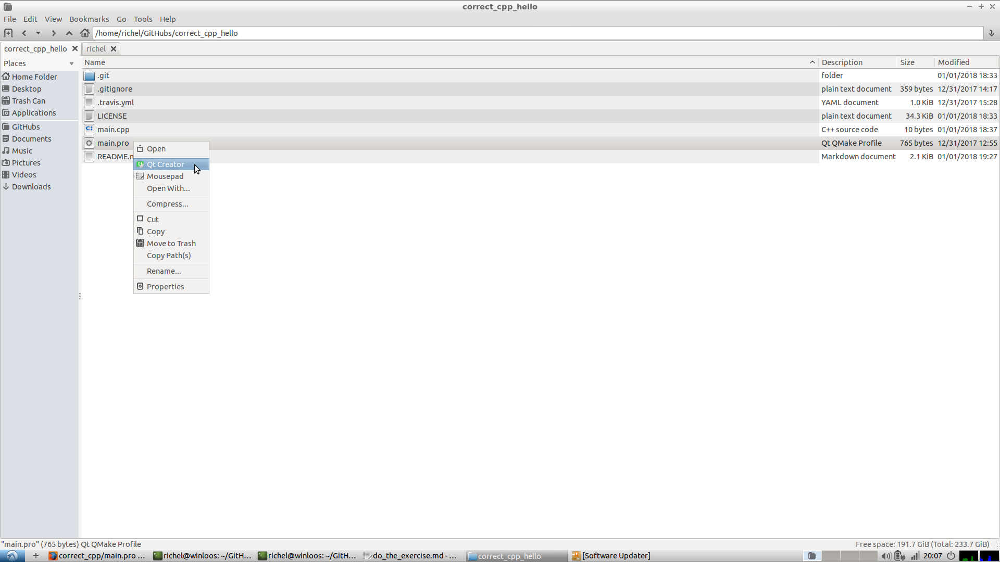
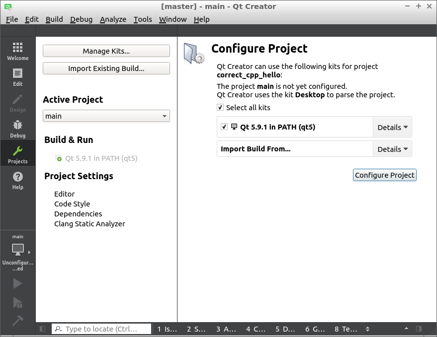
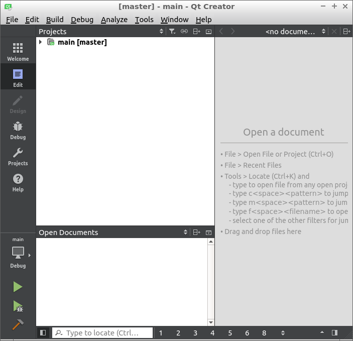
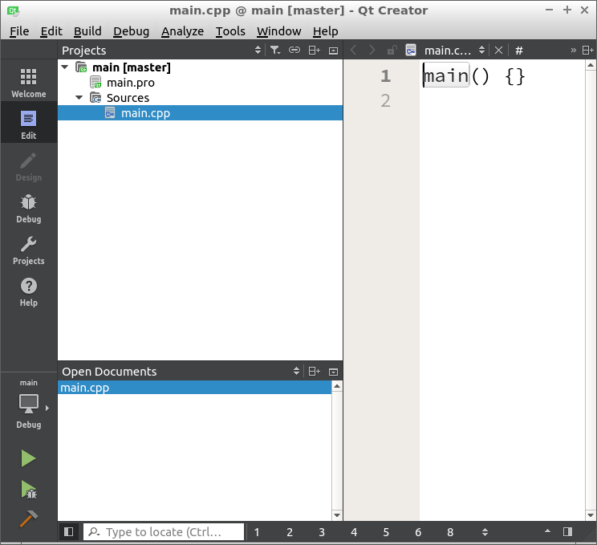

# Do the exercise using Qt Creator

You can [do the exercise](do_the_exercise.md) using Qt Creator.

Each chapter has a link to a Qt Creator project file with the name `main.pro`. Download it in the same folder as the chapter.



You could also re-create a lighter version of it: create a file called `main.pro` with the content below:

```
# Files
SOURCES += main.cpp

# C++17
CONFIG += c++17
QMAKE_CXXFLAGS += -std=c++17

# High warnings levels
QMAKE_CXXFLAGS += -Wall -Wextra -Wshadow -Wnon-virtual-dtor -pedantic -Weffc++ -Werror
```

Open that project file using Qt Creator.



If Qt Creator asks you to configure the project, click on 'Configure project'



Qt Creator will show you its first screen.



At the left, in the 'Project' section, click the drop-down arrow to view the first sections of the project.
Then click the drop-down arrow on 'Sources' to view the source files. Double-click on `main.cpp` to start editing.



Think you are done with the exercise? Time to [push your code](push_your_code.md)!
