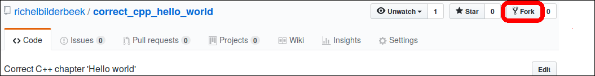

# 1. Fork a chapter

 * Log in to GitHub. No Github account? Create one, its free/gratis
 * Go to the repository of the chapter (for example [hello](https://github.com/richelbilderbeek/correct_cpp)) 
 * Click `Fork` at the top-right.

 * Wait while the repository is copied

Next step is [cloning your fork](2_clone_your_fork.md).

