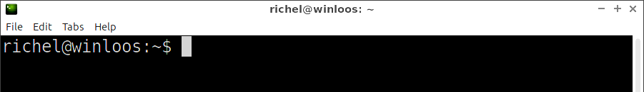
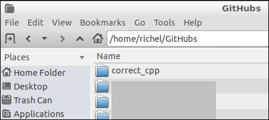

# 2. Clone your fork

After [forking a chapter](1_fork_a_chapter.md), you must [clone your fork](2_clone_your_fork.md). 
This will download the GitHub repository to your local computer.

 * Start your terminal or Git Bash



 * Use `git clone` from the command-line to download your fork. 
   For example, you can download the chapter 
   [scoreboard](https://github.com/richelbilderbeek/correct_cpp_scoreboard) 
   using the command below.
   Replace `[yourname]` by your GitHub username.

```
git clone https://github.com/[yourname]/correct_cpp_scoreboard.git
```

For example, if your username is `chezclaire`, use:

```
git clone https://github.com/chezclaire/correct_cpp_scoreboard.git
```

 * The folder with the GitHub has been created. In this example
   the folder is called `correct_cpp_scoreboard`



 * Use `cd` ('Change Directory') to go into the newly created folder.

```
cd [foldername]
```

For example, if you have just cloned `correct_cpp_scoreboard`, use:

```
cd correct_cpp_scoreboard
```

Now it is time to [Activate Travis CI](3_activate.md).
