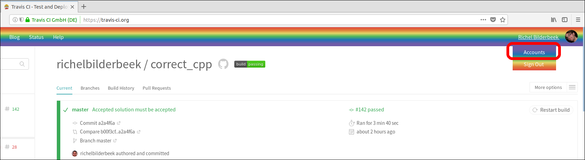
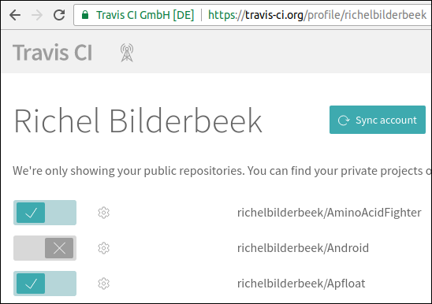

# 3. Activate Travis CI on your GitHub

After [cloning your fork](2_clone_your_fork.md), you must activate Travis CI to check your GitHub.

 * Go to [https://travis-ci.org/](https://travis-ci.org/)
 * Sign in with your GitHub

 * Go to your accounts

 * Click 'Sync accounts'

 * Activate your accounts by clicking the slider to the right

Next step: [modify the README](4_modify_readme.md)