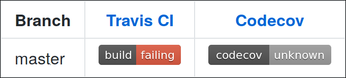
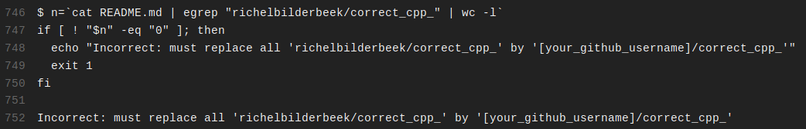

# 7. Correct your GitHub

After [add, commit, push your code](6_push_your_code.md), 
Travis CI will correct your code.

On the GitHub of your fork, at the top, 
the build status of your work is displayed.

If your solution is correct, the build status of your GitHub will be green.
This will also be displayed in [the scoreboard](use_the_scoreboard.md). 
Well done, you just did the exercise correctly!

If your solution is incorrect, the build status will be red. To see
the problem, click the build status button.

This will take you to the Travis CI page of that GitHub. 
At the bottom of the build log, the problem is displayed:

In this example, [modifying the README](4_modify_readme.md)
was done incorrectly.
