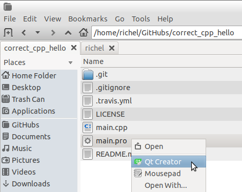
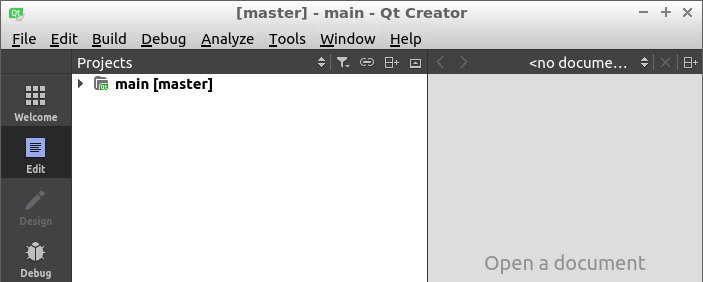
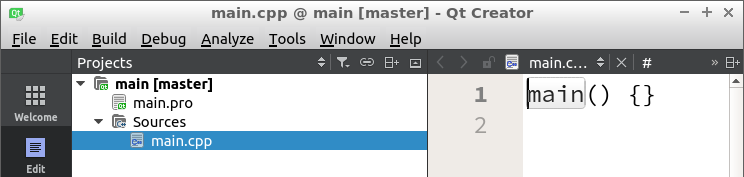

# Do the exercise using Qt Creator

You can [do the exercise](do_the_exercise.md) using Qt Creator.

Each chapter uses [the same Qt Creator project file with the name `main.pro`](../shared/main.pro). 

You can:

 * In your browser, open [the main.pro file](https://raw.githubusercontent.com/richelbilderbeek/correct_cpp/master/shared/main.pro). Use 'save as' to save it in the chapter's folder  
 * From a terminal, in the folder of the chapter, use `wget https://raw.githubusercontent.com/richelbilderbeek/correct_cpp/master/shared/main.pro` to download it

Open that project file using Qt Creator.

If Qt Creator asks you to configure the project, click on 'Configure project'

Qt Creator will show you its first screen.

At the left, in the 'Project' section, click the drop-down arrow to view the first sections of the project.
Then click the drop-down arrow on 'Sources' to view the source files. Double-click on `main.cpp` to start editing.

Think you are done with the exercise? Time to [push your code](push_your_code.md)!
