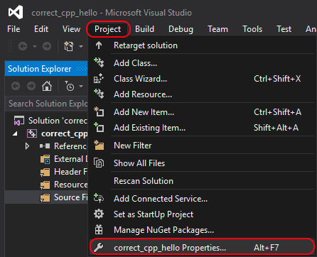
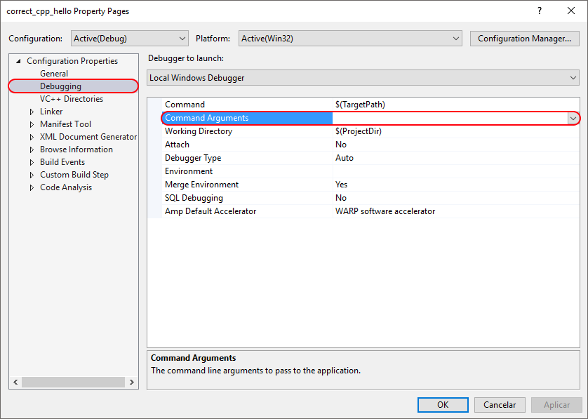
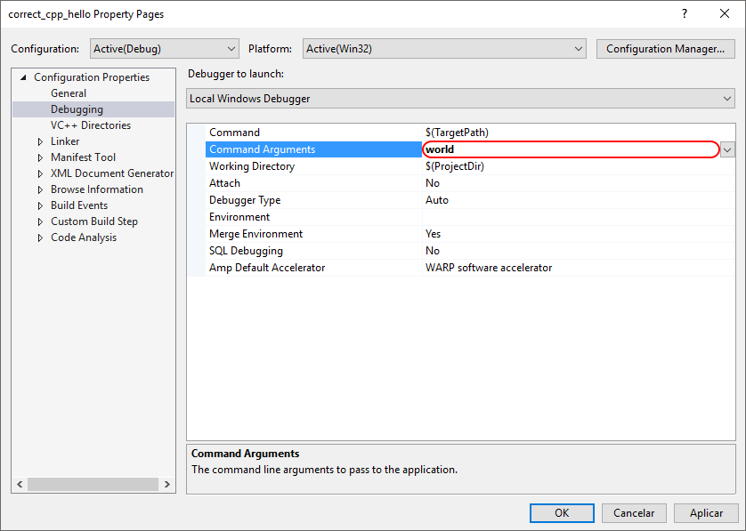

# [Run your program with arguments](run_your_program_with_arguments.md), using Visual Studio

After [doing the exercise](do_the_exercise.md) you run your application from Visual Studio with arguments.

 * Click `Project | [project name] Properties` or ALT-F7

 * Of the Configuration Properties, click 'Debugging' 

 * Right of 'Command Arguments' you can put your arguments

