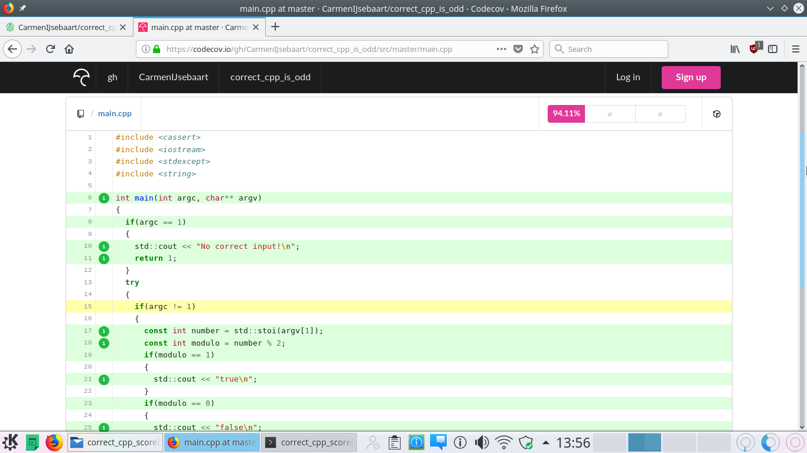

# How to get a 100% code coverage?

In all chapters your code coverage needs to be 100%.

## Achieving 100% code coverage is easy

Already your first code must have 100% code coverage. For the first chapters, this is easy. Here is the solution for the first chapter:

```c++
int main() {}
```

Code coverage is 100%, as all (zero) lines of code are used.

## Losing 100% code coverage by doing something needlessly complex

Here is an example that does not have 100% code coverage:

```c++
int main() 
{
  if (1 + 1 == 3)
  {
    //Line that is never executed
  }
}
```

This course will correct you if you write such code. If for the first simple exercises you do not get 100% code coverage, you did something needlessly complex.

## Achieve 100% code coverage by testing `main`

Here is an example that does not have 100% code coverage:

```c++
#include <iostream>

int main(int argc, char*[]) 
{
  if (argc == 1)
  {
    std::cout << "Program called without arguments\n";
  }
  else
  {
    std::cout << "Program called with arguments\n";
  }
}
```

To achieve 100% code coverage, put the content of `main` in another function, and test that function:

```c++
#include <cassert>
#include <iostream>

int do_main(const int argc) noexcept
{
  if (argc == 1)
  {
    std::cout << "Program called without arguments\n";
  }
  else
  {
    std::cout << "Program called with arguments\n";
  }
  return 0;
}

int main(int argc, char*[]) 
{
  //Calling with one or two arguments should result in an exit code of zero
  assert(do_main(1) == 0);
  assert(do_main(2) == 0);

  return do_main(argc);
}
```

In debug mode, the `assert`s ensure all code is run.
In release mode, the `assert`s are removed, and the program runs cleanly.

The tests do produce output when correct. A test that passes should produce no output. This can be done by only testing the logic:

```c++
#include <cassert>
#include <iostream>

std::string get_text(const int argc) noexcept
{
  if (argc == 1)
  {
    return "Program called without arguments";
  }
  else
  {
    return "Program called with arguments";
  }
}

int do_main(const int argc) noexcept
{
  std::cout << get_text(argc) << '\n';
  return 0;
}

int main(int argc, char*[]) 
{
  assert(get_text(1) != get_text(2));
  return do_main(argc);
}
```

As a bonus, the tests are now actually doing something useful: it would be incorrect if both texts are the same.

If the exact wording of the output is important, consider testing this as well:

```c++
int main(int argc, char*[]) 
{
  assert(get_text(1) == "Program called without arguments");
  assert(get_text(2) == "Program called with arguments");

  // ...
}
```

## Codecov shows some lines in yellow



Yellow lines means that you have partial code coverage.

Partial code coverage is caused by, among others, `if` statements that do not have both results checked.

Here is a simple example:

```c++
constexpr bool is_one(const int i) noexcept
{
  if (i == 1) return true;
  if (i != 1) return false;
}
```

In this example, the second if statement results in partical code coverage, because it will always be true. 
If an if statement is always true, the if statement should be removed. As an internal form of documentation,
an assert may be added:

```c++
constexpr bool is_one(const int i) noexcept
{
  if (i == 1) return true;
  assert(i != 1);
  return false;
}
```

Note that an experienced programmer would remove the problem altoghether and use:

```c++
constexpr bool is_one(const int i) noexcept
{
  return i == 1;
}
```
