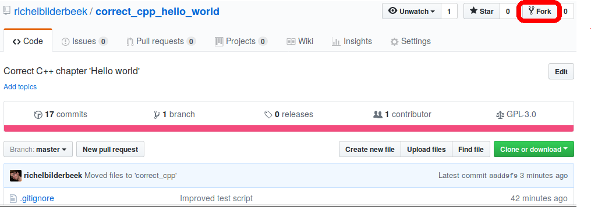

# How this course works

To use and finish a chapter, one needs to the following steps,
explained in detail below.

 * Fork a chapter
 * Download your fork
 * Do the exercise
 * Upload your proposed solution
 * Do a pull request to test your solution

## Fork a chapter

On GitHub, go to the repository of the chapter and click `Fork` at the top-right.



You will need a GitHub account to do so.

## Download your fork

On your local computer, use `git clone` from the command-line to download your fork.

For example, you can download this chapter using this line:

```
git clone https://github.com/yourname/correct_cpp_hello_world.git
```

Replace `yourname` by your GitHub username.

## Do the exercise

Each chapter describes an exercise and supplies a project (`.pro`) file. Open that
project file in the free C++ IDE Qt Creator. All projects have a file 
called `main.cpp`. `main.cpp` is where you must put your code. 

## Upload your proposed solution

On your local computer, use `git push` from the command-line to upload your code.
Before this, you also need to add and commit your proposed changes.

For example:

```
git add --all :/
git commit -m "My proposed changes"
git push
```

## Do a pull request to test your solution

On your fork's GitHub page, click on `Pull request`, which is directly 
below the green `Clone or download` button.


One the chapter's (*not* your fork's) GitHub, at Pull Requests (directly
below the GitHub's title) you can see how well your code did. 

If your solution was correct, the build status of your pull request will
become green, red otherwise.

Your code will be rejected if it contains a solution (this is a course, remember?).
If your Pull Request improves the (text of the) chapter, 
your suggestions are merged after a positive review. 
