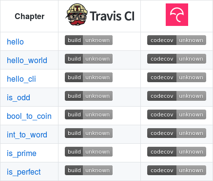

# Use the scoreboard 

If you [correct your GitHub](correct_your_github.md) you can use the scoreboard.

 * Fork [the Correct C++ original scoreboard](https://github.com/richelbilderbeek/correct_cpp_scoreboard)
 * Replace the username `richelbilderbeek` by your own

If you [know how this course works](how_this_course_works.md), this is easy:

 * Forking [the Correct C++ original scoreboard](https://github.com/richelbilderbeek/correct_cpp_scoreboard) is described in [fork a chapter](fork_a_chapter.md)
 * Then [clone your fork](clone_your_fork.md)
 * In the `README.md`, replace the username `richelbilderbeek` by your own
 * [Push your code](push_your_code.md)

## Problems

### Grey build statuses

Grey build statuses mean that either:

  * the repository is not activated
  * no builds for this repository

Click on the grey build status to 

## The repository is not active

To acticate Travis CI, go to [https://travis-ci.org/](https://travis-ci.org/), sign in using your GitHub, click on 'Accounts'

Activate your repository by clicking the slider.

### No builds for this repository

The repository has not received pushes after activation. 

Modify your fork (e.g. add an enter somewhere) and [push you code](push_your_code.md) again.
